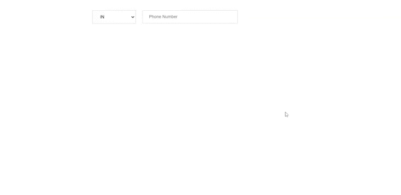

# ReactJS - Phone Number Input

ReactJS based Phone Number component. It provides input field to add single/multiple telephone numbers with validation. The Phone number value is automatically validated on blur event. You can change validation message using props. You can also disable Phone number field using disable props.

## Table of contents

- [Browser Support](#browser-support)
- [Demo](#demo)
- [Getting started](#getting-started)
- [Usage](#usage)
- [Available Props](#available-props)
- [Methods](#methods)
- [Want to Contribute?](#want-to-contribute)
- [Collection of Components](#collection-of-components)
- [Changelog](#changelog)
- [License](#license)
- [Keywords](#Keywords)

## Browser Support

|  |  |  |  |  |
| ---------------------------------------------------------------------------------------- | ------------------------------------------------------------------------------------------- | ---------------------------------------------------------------------------------------- | ---------------------------------------------------------------------------------- | ---------------------------------------------------------------------------------------------------------------------------- |
| 83.0 ✔                                                                                   | 77.0 ✔                                                                                      | 13.1.1 ✔                                                                                 | 83.0 ✔                                                                             | 11.9 ✔                                                                                                                       |

## Demo

[](https://github.com/weblineindia/ReactJS-Phone-Number-Input/phone.gif)

## Getting started

Install the npm package:

```bash
npm install react-weblineindia-phone-number
#OR
yarn add react-weblineindia-phone-number
```

## Usage

Use the `<react-weblineindia-phone-number>` component:

```js
import React, { Component } from "react";
class Test extends Component {
 constructor(props) {
    super(props);
       this.state = {
      phoneValue: [{ phone: "" }],
       preferredCountries:[{code: "IN",maxLength: 10},{code: "US",maxLength: 11}],
      defaultSelectedCountry: [{ code: "US", maxLength: 10 }],
       }
 }
 onChange(event, index) {
    let value = this.state.phoneValue;
    value[index].phone = event.target.value;
    this.setState({
       phoneValue: value,
    })
 }
  onMultiplePhoneAdd() {
    this.state.phoneValue.push({
      phone: "",
    });
    this.state.defaultSelectedCountry.push(this.state.defaultSelectedCountry[0]);
  }
    onChageDropdown(event ,index){
    debugger
    this.setState({
      defaultSelectedCountry :event
    })
  }
  render() {
    return (
      <div>
        {this.state.phoneValue.map((item, i) => {
          return (
            <div key={i}>
              <Phone
                isShowPlus={this.state.phoneValue.length - 1 === i}
                value={this.state.phoneValue}
                index={i}
                onMultiplePhone={this.onMultiplePhoneAdd.bind(this)}
                onChange={this.onChange.bind(this)}
                preferredCountries={this.state.preferredCountries}
                onChageDropdown={this.onChageDropdown.bind(this)}
                defaultSelectedCountry={this.state.defaultSelectedCountry}
              />
            </div>
          );
        })}
      </div>
    );
  }
}

export default Test;

```

## Available Props

| Prop                   | Type          | default                        | Description                                     |
| ---------------------- | ------------- | ------------------------------ | ----------------------------------------------- |
| maxlength              | Number        | 10                             | The phone maxlength                             |
| id                     | String        |                                | The phone id                                    |
| duplicatePhoneError    | String        | Do not enter same Phone Number | Duplicate error message for phone number        |
| onMultiplePhone        | Function      |                                | When click on plus icon on Phone number field   |
| name                   | String        | Phone                          | The Phone name.                                 |
| index                  | Number        | 0                              | The Phone index.                                |
| values                 | Array[Object] | [{phone : ''}]                 | The Phone default array                         |
| isMultiple             | Boolean       | true                           | A flag to implement multiple Phone              |
| isShowPlus             | Boolean       | false                          | A flag to show plus icon for add multiple Phone |
| placeholder            | String        | Phone                          | The Phone placeholder                           |
| disabled               | Boolean       | false                          | Disable phone field                             |
| tabindex               | Number        | 0                              | The Phone tabIndex                              |
| preferredCountries     | Array[Object] | []                             | The Phone Code peferredCountries                |
| ignoredCountries       | Boolean       | false                          | The Phone country list not showing              |
| defaultSelectedCountry | Array[Object] | [{code: "IN",maxlength: 10}]   | The Phone default country                       |

## Methods

| Name            | Description                                             |
| --------------- | ------------------------------------------------------- |
| focus           | Gets triggered when the input field receives focus.     |
| blur            | Gets triggered when the input field loses focus.        |
| change          | Gets triggered every time input got changed.            |
| onChageDropdown | Gets triggered every time phone code got changed.       |
| input           | Gets triggered every time phone code value got changed. |

## Want to Contribute?

- Created something awesome, made this code better, added some functionality, or whatever (this is the hardest part).
- [Fork it](http://help.github.com/forking/).
- Create new branch to contribute your changes.
- Commit all your changes to your branch.
- Submit a [pull request](http://help.github.com/pull-requests/).

---

## Collection of Components

We have built many other components and free resources for software development in various programming languages. Kindly click here to view our [Free Resources for Software Development](https://www.weblineindia.com/software-development-resources.html)

---

## Changelog

Detailed changes for each release are documented in [CHANGELOG.md](./CHANGELOG.md).

## License

[MIT](LICENSE)

[mit]: https://github.com/weblineindia/ReactJS-Phone-Number-Input/blob/master/LICENSE

## Keywords

react-weblineindia-phone-number, phone-input, phonenumber-input, react-phone-input, telephone-input
